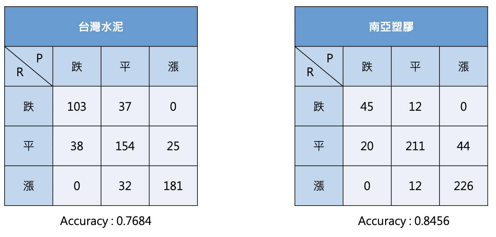

# sponti
## [Abstract]
利用技術分析分析股票趨勢，資料樣式如下（暫不提供）：

## [Flow]

1. 計算個股每日技術指標，使用KDJ, MACD, Bollinger Band and Williams %R。
2. 將指標數值轉為訊號分類。

3. CNN訓練每30日左組成的技術指標分類表格，縱軸為不同技術指標的訊號標記，共有26種不同的訊號，橫軸為天數，此實驗預設30日。如下：

4. 成果：

5. 額外使用LSTM訓練股價結合上述所產出的趨勢資料預測未來股價（效果不佳）

## [How to use]
執行main.py，此程式會將data資料夾中OTC2016~2018與TWSE2016~2018的原始資料整理，整理方式如下:

1.取出個股資料
2.計算個股技術指標數值
3.轉換技術指標數值to趨勢  ex:KDJ指標K值>D值屬於漲勢，標記為漲
4.儲存檔案在data/ti中

執行splite_data.ipynb，此程式將上述處理好的資料依據模型需求作再次整理，將30天資料合併成1個資料，並對此資料做標記。

ti_cnn.ipynb : CNN模型利用技術指標趨勢預測趨勢  [[**最重要**]]
ti_att_lstm.ipynb : ATTENTION LSTM模型利用CNN的結果結合股價預測未來股價   [[**額外**]]
lstm_close : 傳統lstm利用股價預測股價   [[**額外**]]
